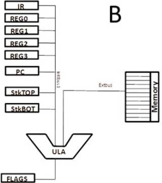

# oac-arquitetura

Repositório com código para o [trabalho de
OAC](https://sites.google.com/site/alvarodegas/degas-home-page/acad%C3%AAmico/disciplinas/2025-1/organiza%C3%A7%C3%A3o-e-arquitetura-de-computadores)
(Organização e Arquitetura de Computadores), no semestre 2025.1.

O objetivo é, tendo o código de simulador disponibilizado pelo
professor, ajustar as classes `Architecture` e `Assembler` de modo que
os comandos sejam suportados e a arquitetura escolhida seja devidamente
emulada.

Nosso grupo ficou com: Arquitetura B, Assembly 4.



O assembler pode ser iniciado em `assembler.Assembler.main()`, tendo um
arquivo `.dsf` como entrada e um `.dxf` como saída. O arquivo `.dxf`
pode ser então entregue ao `architecture.Architecture.main()`, que irá
lê-lo e inicializar a simulação com tal programa carregado na memória.

## formato do arquivo assembly (`.dsf`)

Um programa começa com um conjunto de linhas de variáveis. Cada linha só
tem um identificador, que começa com um caractere alfabético e
potencialmente mais caracteres alfanuméricos.

Depois disso, são seguidas múltiplas linhas dos tipos:

- labels (nomes de endereços, seguindo o mesmo padrão de variáveis,
  imediatamente seguidos por um `:`);

- comandos (ver seção dedicada abaixo);

A qualquer momento podem ter linhas vazias.

## comandos

```
add %<regA> %<regB>        || RegB <- RegA + RegB
add <mem> %<regA>          || RegA <- memória[mem] + RegA
add %<regA> <mem>          || Memória[mem] <- RegA + memória[mem]

sub <regA> <regB>          || RegB <- RegA - RegB
sub <mem> %<regA>          || RegA <- memória[mem] - RegA
sub %<regA> <mem>          || memória[mem] <- RegA - memória[mem]

move <mem> %<regA>         || RegA <- memória[mem]
move %<regA> <mem>         || memória[mem] <- RegA
move %<regA> %<regB>       || RegB <- RegA
move imm %<regA>           || RegA <- immediate

inc %<regA>                || RegA++
inc <mem>                  || memória[mem]++

jmp <mem>                  || PC <- mem (desvio incondicional)
jn <mem>                   || se última operação<0 então PC <- mem (desvio condicional)
jz <mem>                   || se última operação=0 então PC <- mem (desvio condicional)
jnz <mem>                  || se última operação!=0 então PC <- mem (desvio condicional)

jeq %<regA> %<regB> <mem>  || se RegA==RegB então PC <- mem (desvio condicional)
jgt %<regA> %<regB> <mem>  || se RegA>RegB então PC <- mem (desvio condicional)
jlw %<regA> %<regB> <mem>  || se RegA<RegB então PC <- mem (desvio condicional)

call <mem>                 || PC <- mem ( desvio incondicional mas,
                           || antes de desviar, empilha o endereço de
                           || retorno (endereço da instrução
                           || imediatamente posterior ao call (push(PC++))) )

ret                        || PC <- pop() (desvio incondicional)
```
